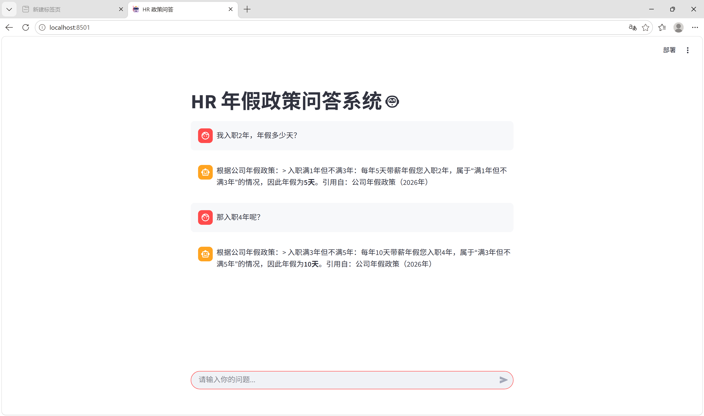
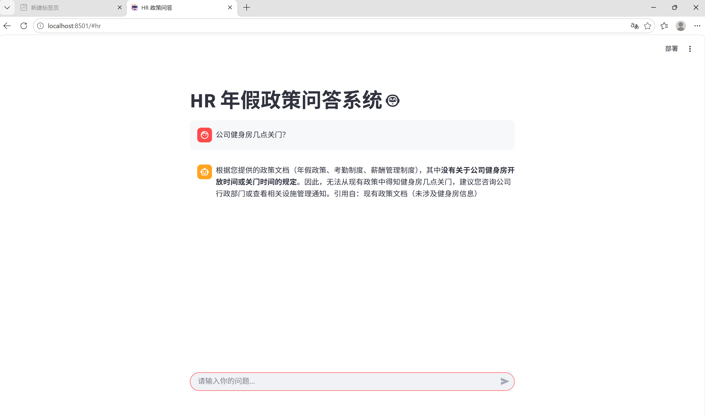

# HR 政策问答系统（RAG）

基于 **LangChain 1.0 + FAISS + DeepSeek** 构建的企业政策智能问答系统。支持多份政策文档检索、流式输出、多轮对话记忆，一键 Docker 部署。

## 效果展示

### 多轮对话记忆（连续提问，无需重复说明上下文）



### 诚实回答（文档中没有的信息，不编造）



## 功能特性

**多文档检索**：自动扫描 `data/` 目录，支持任意数量政策文档（年假/考勤/报销/薪酬）
**来源标注**：回答时注明引用自哪份文档，可追溯、可验证
**多轮对话记忆**：基于上下文理解省略说法（如「那入职4年呢？」）
**流式输出（SSE）**：逐字返回答案，首字延迟 < 1s
**诚实回答**：文档中无相关信息时明确告知，不编造
**Web 前端**：Streamlit 聊天界面，开箱即用
**Docker 一键部署**：前后端一个镜像，一条命令启动

## 系统架构

```
用户提问
   │
   ▼
┌──────────────┐    ┌──────────────────┐
│  Streamlit   │───▶│  FastAPI 后端     │
│  前端(8501)  │    │  /ask/stream     │
└──────────────┘    └────────┬─────────┘
                             ▼
┌──────────────────────────────────────┐
│  LCEL 链（LangChain 1.0）             │
│  ┌─────────┐   ┌─────────────────┐   │
│  │ FAISS   │──▶│ ChatPrompt      │   │
│  │ 检索TopK│   │ 模板填充        │   │
│  └─────────┘   └────────┬────────┘   │
│                         ▼            │
│              ┌──────────────────┐    │
│              │ DeepSeek API     │    │
│              │ 流式生成回答      │    │
│              └──────────────────┘    │
└──────────────────────────────────────┘
```

**数据链路**：`data/ 文档 → TextLoader → 切分(300字/重叠50) → Embedding(384维) → FAISS 索引 → 检索Top-4 → Prompt → DeepSeek → 流式返回`

## 技术栈

| 组件 | 用途 |
|------|------|
| Python 3.11+ | 开发语言 |
| LangChain 1.0 | LCEL 链式编排 |
| FAISS | 向量检索（相似度搜索） |
| Sentence-Transformers | 多语言 Embedding（384维） |
| DeepSeek API | LLM 生成 |
| FastAPI + uvicorn | REST API 服务 |
| Streamlit | 聊天前端 |
| Docker | 容器化部署 |

## 快速开始

### 方式一：本地运行

```bash
# 1. 安装依赖
pip install -r requirements.txt

# 2. 设置环境变量（Windows CMD）
set DEEPSEEK_API_KEY=你的Key
set HTTP_PROXY=
set HTTPS_PROXY=

# 3. 启动后端（端口 8000）
python fastapi_rag.py

# 4. 新开终端，启动前端（端口 8501）
streamlit run app.py
```

### 方式二：Docker 一键启动

```bash
docker run -e DEEPSEEK_API_KEY=你的Key \
  -v 本机模型缓存:/root/.cache/huggingface/hub \
  -p 8000:8000 -p 8501:8501 \
  rag-service
```

> 提示：Embedding 模型缓存挂载后无需重新下载。

## API 接口

| 接口 | 方法 | 说明 |
|------|------|------|
| `/` | GET | 服务信息与接口列表 |
| `/health` | GET | 健康检查 |
| `/ask/stream` | POST | 流式问答（SSE） |

**流式问答示例：**

```bash
curl -N -X POST http://localhost:8000/ask/stream \
  -H "Content-Type: application/json" \
  -d '{"query": "我入职2年，年假多少天？"}'
```

## 项目结构

```
├── fastapi_rag.py       # 主程序（RAG链 + FastAPI）
├── app.py               # Streamlit 前端
├── evaluate_simple.py   # 评估脚本（LLM as Judge）
├── evaluate_compare.py  # K值对比实验
├── data/                # 政策文档（自动扫描）
│   ├── policy.txt       # 年假政策
│   ├── attendance.txt   # 考勤制度
│   ├── expense.txt      # 报销规定
│   └── salary.txt       # 薪酬制度
├── Dockerfile           # 镜像构建
├── start.sh             # 容器启动脚本
├── screenshots/         # 演示截图
└── requirements.txt
```

## 评估结果

使用 **LLM as Judge** + **Hit Rate（检索命中率）** 双指标，8 个测试问题（含 4 个措辞不匹配难题）评估：

| 指标 | K=1 | K=4 | K=8 |
|------|-----|-----|-----|
| Hit Rate（检索命中率） | 0.62 | **0.88** | 0.88 |
| Faithfulness（忠实度） | 1.00 | 1.00 | 1.00 |
| Relevancy（相关性） | 1.00 | 1.00 | 1.00 |

> 结论：K=4 为当前文档集最优平衡点（命中率 62% → 88%）。
> 实验脚本：`evaluate_compare.py

## 相关链接

- GitHub: https://github.com/yfjha/rag-policy-qa
- 知乎文章1 - RAG 自学 15 天记录: https://zhuanlan.zhihu.com/p/2063315521911644402
- 知乎文章2 - Docker 部署踩坑: https://zhuanlan.zhihu.com/p/2065518716264126416
